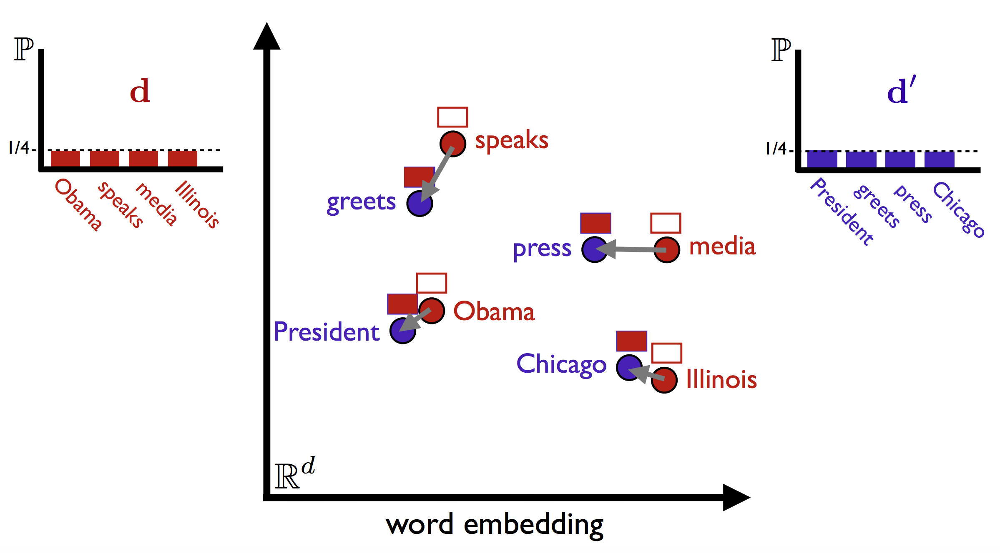

```{r setup, include=FALSE}
knitr::opts_chunk$set(echo = FALSE, message = FALSE)
```

```{r, echo=FALSE}
library(tm)
library(stringr)
library(wordnet)
library(randomForest)
library(text2vec)
setDict("/usr/share/wordnet/dict")
Sys.setenv(WNHOME = "/usr/share/wordnet")
stopifnot(initDict())

transformCorpus <- function(reviews){
  reviews <- tm_map(reviews, stripWhitespace)
  reviews <- tm_map(reviews, content_transformer(tolower))
  f <- content_transformer(function(x, pattern, sub) gsub(pattern, sub, x))
  reviews <- tm_map(reviews, f, "'[]\\?!\"\'#$%&(){}+*/:;,._`|~\\[<=>@\\^-]'", " ")
  reviews <- tm_map(reviews, f, "  ", " ")
  reviews <- tm_map(reviews, removeWords, stopwords("english"))
  ##reviews <- tm_map(reviews, stemDocument)
  return(reviews)
}
```

##Introduction
This project aims to answer the challenge proposed by Quora: Identify questions pairs that have the same meaning.
That is, for each pair (question1, question2) predict if they mean the same thing.
Our training data is a table with:  
* id - the id of a training set question pair  
* qid1, qid2 - unique ids of each question  
* question1, question2 - the full text of each question  
* is_duplicate - the target variable, set to 1 if question1 and question2 have essentially the same meaning, and 0 otherwise.  
  
There is also a test dataset, which do not contain the 'is_duplicate' variable. This data set is only relevant to the kaggle submission and will not be used here.


##Data Preprocessing

First of all, the lines in the dataset that contain NA questions are removed. 

Then, since the train dataset is very large, and feature extration will take a long time, I created two samples to work with:  
* trainSample - 20.000 question pairs.
* testSample - 100.question pairs.

Some basic processing has to be done over the data.  
* Remove whitespace (tabs and new lines)  
* Transform everything to lower case  
* Remove pontuation signs and symbols  
* Remove stopwords (very common words, like "the", "in", "i", ...)

During this process some of the questions become empty, so the rows are removed. For example:  
* "Where are him from?"  
* "What is 1?"  
* "What should I do?"  
* "What is it that you are doing and why?"

##Feature extration

###Distance between questions
The first feature calculated uses the distance between the two questions.
We form the Document Term Matrix for the two questions that contains the frequency of each term, per document.
From this, the Term frequency–inverse document frequency is calculated.
The distance is calculated as the sum of the absolute diferences of the Tf-Idf for each term.
```{r, echo=FALSE}

train <- read.csv("train.csv", header = TRUE, stringsAsFactors = FALSE, na.strings = "")
test <- read.csv("test.csv", header = TRUE, stringsAsFactors = FALSE, na.strings = "")
train <- na.exclude(train)
test <- na.exclude(test)
set.seed(2017)
trainSample <- train[sample(nrow(train), 200),]
testSample <- train[sample(nrow(train), 1000),]

for(id in 1:nrow(trainSample)){
  questionCorpus <- VCorpus(VectorSource(c(trainSample$question1[id], trainSample$question2[id])))
  questionCorpus <- transformCorpus(questionCorpus)
  dtm <- DocumentTermMatrix(questionCorpus)
  if(sum(dtm[1,]$i) == 0){
    print(trainSample$question1[id])
    print(dtm[1,])
    trainSample <- trainSample[-id,]
  }
  else{
    if(sum(dtm[2,]$i) == 0){
      print(trainSample$question2[id])
      print(dtm[2,])
      trainSample <- trainSample[-id,]
    }
    else{
      dtm2 <- weightTfIdf(dtm)
      trainSample$distance[id] <- dist(dtm2)
      similarity <- sim2(x = as.matrix(dtm[1,]), y= as.matrix(dtm[2,]), norm = 'none')
      distance <- dist2(x = as.matrix(dtm[1,]), y= as.matrix(dtm[2,]), norm = 'none')
      trainSample$sim2[id] <- sum(similarity)/nrow(similarity)
      trainSample$dist2[id] <- sum(distance)/nrow(distance)
      count <- 0
      dtm1m <- as.matrix(dtm[1,])
      dtm2m <- as.matrix(dtm[2,])
      for(i in 1:length(dtm1m)){
          count <- count + min(dtm1m[i], dtm2m[i])
      }
      trainSample$lengthQ1[id] <- sum(dtm[1,])
      trainSample$lengthQ2[id] <- sum(dtm[2,])
      trainSample$shared[id] <- count
    }
  }
}

for(id in 1:nrow(testSample)){
  questionCorpus <- VCorpus(VectorSource(c(testSample$question1[id], testSample$question2[id])))
  questionCorpus <- transformCorpus(questionCorpus)
  dtm <- DocumentTermMatrix(questionCorpus)
  if(sum(dtm[1,]$i) == 0){
    print(testSample$question1[id])
    print(dtm[1,])
    testSample <- testSample[-id,]
  }
  else{
    if(sum(dtm[2,]$i) == 0){
      print(testSample$question2[id])
      print(dtm[2,])
      testSample <- testSample[-id,]
    }
    else{
      dtm2 <- weightTfIdf(dtm)
      testSample$distance[id] <- dist(dtm2)
      similarity <- sim2(x = as.matrix(dtm[1,]), y= as.matrix(dtm[2,]), norm = 'none')
      distance <- dist2(x = as.matrix(dtm[1,]), y= as.matrix(dtm[2,]), norm = 'none')
      testSample$sim2[id] <- sum(similarity)/nrow(similarity)
      testSample$dist2[id] <- sum(distance)/nrow(distance)
      count <- 0
      dtm1m <- as.matrix(dtm[1,])
      dtm2m <- as.matrix(dtm[2,])
      for(i in 1:length(dtm1m)){
          count <- count + min(dtm1m[i], dtm2m[i])
      }
      testSample$lengthQ1[id] <- sum(dtm[1,])
      testSample$lengthQ2[id] <- sum(dtm[2,])
      testSample$shared[id] <- count
    }
  }
}
trainSampleSimple <- trainSample[,c("distance", "is_duplicate")]
trainSampleSimple$is_duplicate <- as.factor(trainSampleSimple$is_duplicate)
testSampleSimple <- testSample[,c("distance", "is_duplicate")]
testSampleSimple$is_duplicate <- as.factor(testSampleSimple$is_duplicate)

m <- randomForest(is_duplicate ~ ., trainSampleSimple)
res <- predict(m, testSampleSimple)
tables <- table(res, testSampleSimple$is_duplicate)
error <- 1-(sum(diag(tables)))/sum(tables)
```
Confusion Matrix:
```{r}
tables
```

Error Rate:
```{r}
error
```


###Similarity and extra distance features

Upon finding a promosing package "text2vec" I decided to experiment with some new measures.
Dist2 and Sim2 function return a matrix that represents similarity or distance between both questions like this:
```{r}
question1 <- train$question1[19]
question2 <- train$question2[19]
tokens <- list(question1, question2) %>% tolower() %>% word_tokenizer()
v = create_vocabulary(itoken(tokens), stopwords = stopwords("english"))
corpus = create_corpus(itoken(tokens), vocab_vectorizer(v, skip_grams_window = 3))
dtm = get_dtm(corpus)
tcm = get_tcm(corpus)
similarity <- sim2(x = as.matrix(dtm[1,]), y= as.matrix(dtm[2,]), norm = 'none')
similarity
```

To calculate the features I sum the value in the matrix and divide by the number of rows.
```{r}
trainSampleSimple <- trainSample[,c("distance", "dist2", "sim2", "is_duplicate")]
trainSampleSimple$is_duplicate <- as.factor(trainSampleSimple$is_duplicate)
testSampleSimple <- testSample[,c("distance", "dist2", "sim2", "is_duplicate")]
testSampleSimple$is_duplicate <- as.factor(testSampleSimple$is_duplicate)

m <- randomForest(is_duplicate ~ ., trainSampleSimple)
res <- predict(m, testSampleSimple)
tables <- table(res, testSampleSimple$is_duplicate)
error <- 1-(sum(diag(tables)))/sum(tables)
```
Confusion Matrix:
```{r}
tables
```

Error Rate:
```{r}
error
```

###Number of words shared and length of both questions
Counts the number of shared words between question one and two, as well as the number of words in each question.

```{r}
trainSampleSimple <- trainSample[,c("lengthQ1", "lengthQ2", "shared", "is_duplicate")]
trainSampleSimple$is_duplicate <- as.factor(trainSampleSimple$is_duplicate)
testSampleSimple <- testSample[,c("lengthQ1", "lengthQ2", "shared", "is_duplicate")]
testSampleSimple$is_duplicate <- as.factor(testSampleSimple$is_duplicate)

m <- randomForest(is_duplicate ~ ., trainSampleSimple)
res <- predict(m, testSampleSimple)
tables <- table(res, testSampleSimple$is_duplicate)
error <- 1-(sum(diag(tables)))/sum(tables)
```

Confusion Matrix:
```{r}
tables
```

Error Rate:
```{r}
error
```


## Extra features

The package text2vec first caught my attention because it had functions that seem usefull for this problem.


###Global Vectors for Word Representation

GloVe is an unsupervised learning algorithm for obtaining vector representations for words.
Training is performed on aggregated global word-word co-occurrence statistics from a corpus.
The resulting representations showcase interesting linear substructures of the word vector space.


This would allow to calculate the value of the vectors from both questions, and check if they have a similar value.
The problem in applying this feature is that the vectors are trained from the questions, which have low number of words.
That means that the vectors obtained were not representative of the question.

```{r}
question1 <- train$question1[1]
question2 <- train$question2[1]
tokens <- list(question1, question2) %>% tolower() %>% word_tokenizer()
v = create_vocabulary(itoken(tokens), stopwords = stopwords("english"))
corpus = create_corpus(itoken(tokens), vocab_vectorizer(v, skip_grams_window = 3))
dtm = get_dtm(corpus)
tcm = get_tcm(corpus)
glove_model = GlobalVectors$new(word_vectors_size = 3, max_cost=5, vocabulary = v, x_max = 2)
fit(tcm, glove_model, n_iter = 20)
wv <- glove_model$get_word_vectors()
```

Term co-ocurrence matrix
```{r}
tcm
```

Word Vectors
```{r}
wv
```


###Relaxed Word Movers Distance

Relaxed word movers distance tries to measure distance between documents by calculating how
hard is to transofrm words from first document into words from second document and vice versa.

For example, two headlines:  
* Obama speaks to the media in Illinois  
* The President greets the press in Chicago  



This metric seems like it could make good feature and was one of the reasons that I decided to try this package.
However I was not sucessful in the implementation because it makes use of the word vectors calculated with the GloVe Model.
